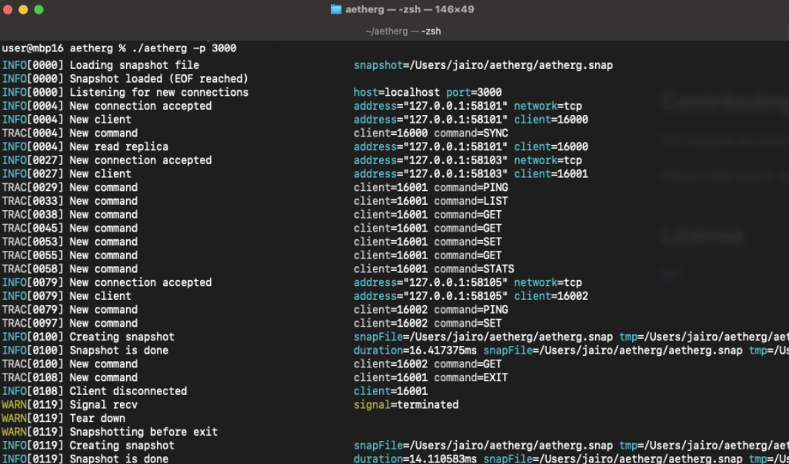

# Aetherg

Aetherg is a redis-like key-value database writen in [Go](https://go.dev) for educational purpose only.



## How to Run

To run a master read and write instance:

```bash
go build .
./aether -p 3000 # Run master server at port 3000
```

To run a read replica (read-only) instance:

```bash
./aether -r -p 3001 # Run read replica at port 3001
```

## How to Use

You can use the CLI client writen in Python:

```bash
./aetherc localhost 3000
```

Or you can simply use `telnet` or `netcat`:

```bash
telnet localhost 3000
```

### Available Commands

The command and response text protocol is heavily based on the [Redis Protocol](https://redis.io/docs/reference/protocol-spec/):

* _**SET** key "value" [EXP ttl]_ set a key to a string value (use `EXP` to expiration time in secs)
* _**GET** key_ return the string value of the key
* _**PING**_ to test communication
* _**RM** key_ delete a key
* _**RMALL**_ remove all keys
* _**LIST**_ to list all keys
* _**STATS**_ get status info about the server
* _**SYNC**_ used by the replica instances
* _**EXIT**_ exit session

## How to Test

There are two test suit available: The unit tests written using the default Go testing framework

```bash
go test .
```

and a few system tests written as Python scripts:

```bash
# Start a aetherg instance and run a bunch of commands innit
python3 test/rw.py 

# Test if aetherg is doing proper saving data do disk
python3 test/snapshot.py

# Spawn a master instance and two replicas to test they are syncing properly
python3 test/parallel.py 
```
